# todoapp

This is my first Flutter project as i participated to the challenge #30DaysOfFlutter .Essentially, it is a simple note-taking platform, where you can write all the important to-dos edit and delete  then  tick off the tasks after they're done.

# Screenshots
## Light mode
   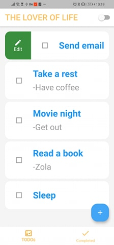  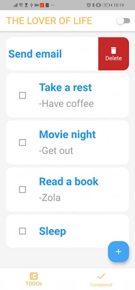 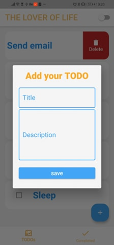 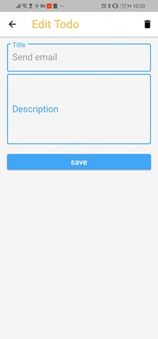 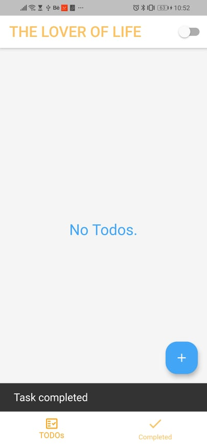 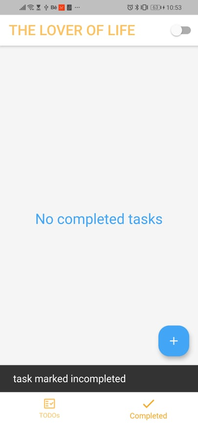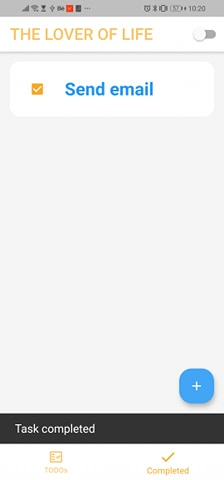
## Dark mode 
 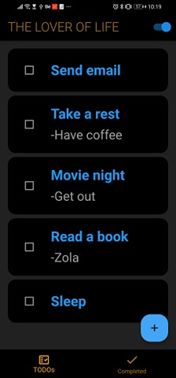  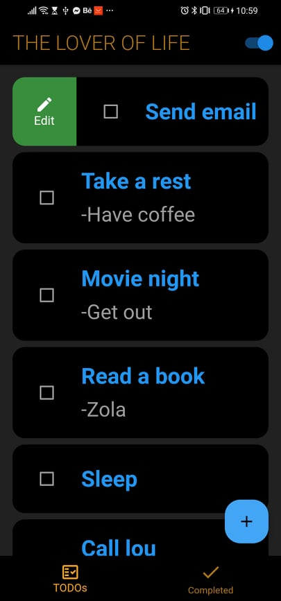  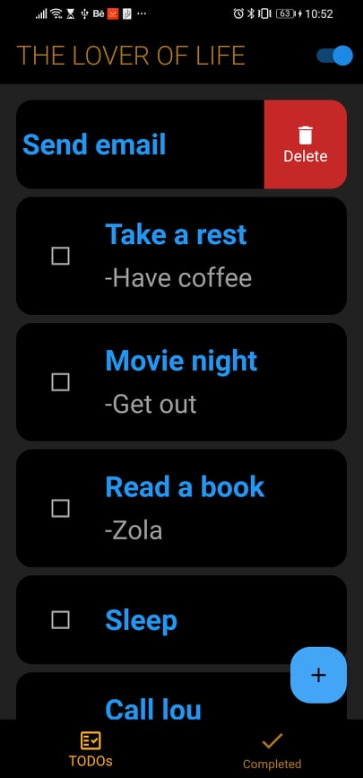 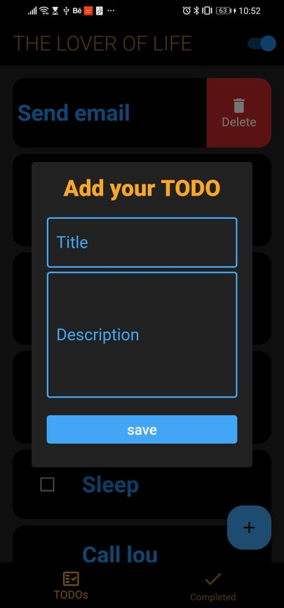 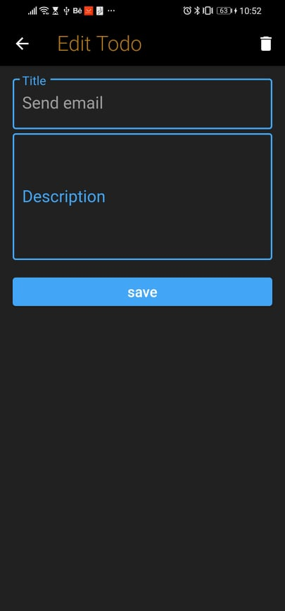 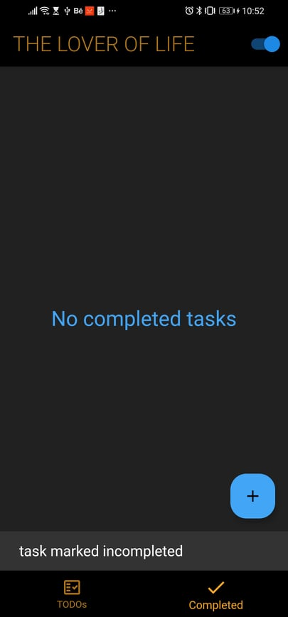 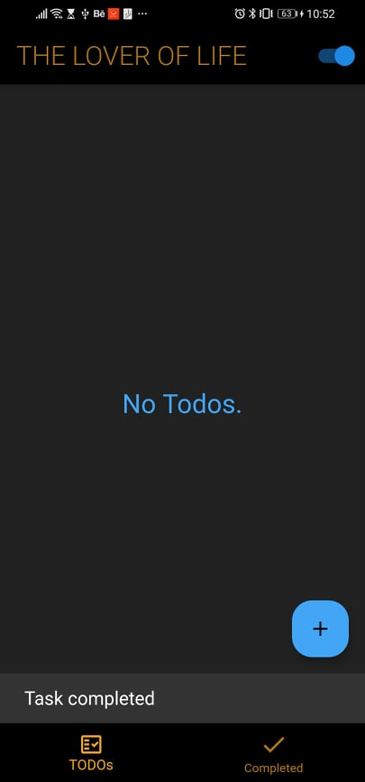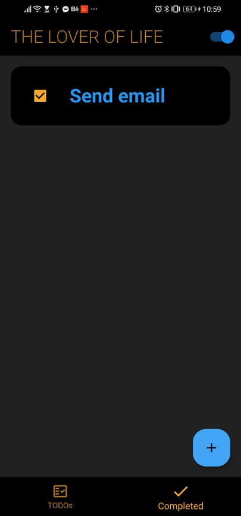
